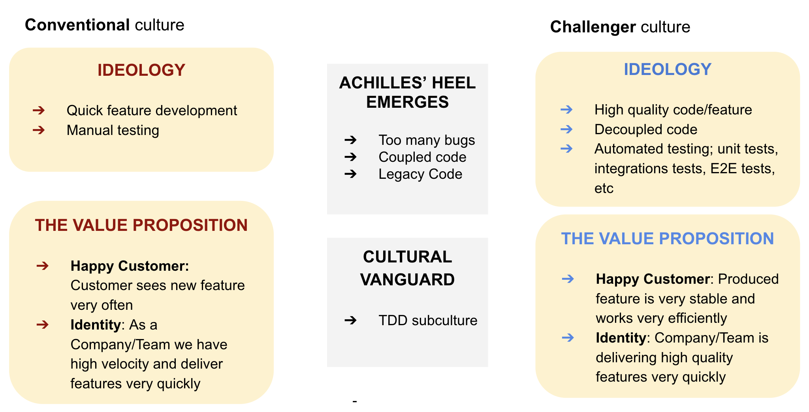

I was driving to supermaket and while waitng under traffic light noticed that someone threw cigaret from the van. By approaching a bit closer I noticed that the van belonged to the company which was responsible for keeping city clean! I was really schoked: how can one do things which are completely oposite to her professions' principles; in this case keeping the city clean.
Similiarly, in a world of software development, coding standards, test coverage and team's disciplinarity should be part of Company's, or at least part of team's culture.

Below I am going to present a framework how to make unit testing as part of team culture. Please note that unit testing topic is just an example and the framework can be used for other topics/ideas as well.

**Step 1.** First step is to deconstruct existing approach/culture. 
Particularly, when engineers don't write tests usually they say we don't have time to write tests and we have QA team which will do testing for us! Indeed, at the beginning write tests can be slow and with nowdays frameworks you can quickly create apps, features and present to your users. And Product owners and managers usually are happy with this as they can deliver features to the end users in very fast manner.

**Step 2.** Cultural disruption: identifing the Achilles' heel.
Once your application grows you realise that you constantly get bug reports, changing one feature implementation is having side effect on another feature, i.e. you have coupled components in a code. And saddanly your backlog is called buglog, because you have more exisitng feature to fix rather than to develop.

**Step 3.** Mine the cultural vanguard.
Gr=le culture of exploration kara ogni
Diversity in the team

**Step 4.** Create an idealogy that challenges the Achilles's heel
The

My conclusion is that there are things you can never achieve without having them as part of the culture. Rules and laws can assist, but never be single pilar. Education and motivation(coaching, guiding, transparency, etc) hand by hand can really be tools to achieve cultural changes, i.e. solve the problem from the root level. And it's not one night project. As a leader you have to repeat, observe, learn and repeat again. 

It's very important to have defined and clearly communicated and agreed ideology, vision, standards, principles, vision and long term goals. For instance: keep our city clean, only accept high quality code changes, etc. Once people are convinced and truly belive they will follow this culture and even start advocating it.

Below is the framework which can be used to achieve that cultural change: 